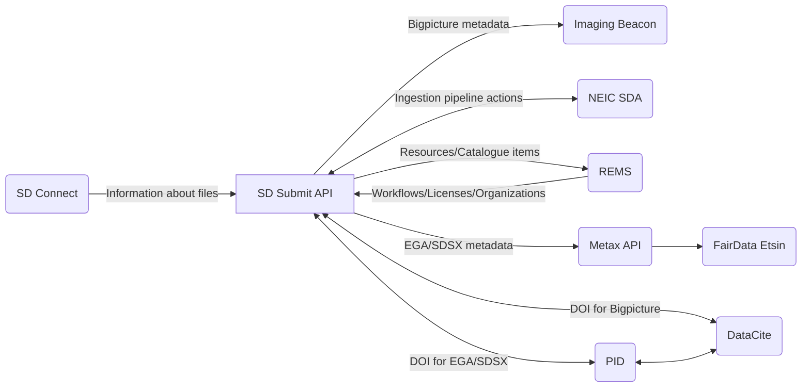

# SD Submit API


[](https://coveralls.io/github/CSCfi/metadata-submitter?branch=main)
[](https://github.com/pre-commit/pre-commit)
[](https://github.com/PyCQA/pylint)

Metadata submission API, which handles programmatic submissions of EGA metadata, Bigpicture metadata and SDSX (generic) metadata models. Metadata can be submitted either via XML files or via web form submissions. The submitted and processed metadata as well as other user and project data is stored in a MongoDB instance as queryable JSON documents.

Graphical UI implementation for web form submissions is implemented separately here: [metadata-submitter-frontend](https://github.com/CSCfi/metadata-submitter-frontend).

SD Submit API also communicates with the following external services via their respective API:
- SD Connect ([source code](https://github.com/CSCfi/swift-browser-ui))
- Imaging Beacon ([source code](https://github.com/CSCfi/imaging-beacon))
- NeIC Sensitive Data Archive ([docs](https://neic-sda.readthedocs.io/en/latest/))
- REMS ([source code](https://github.com/CSCfi/rems))
- Metax ([docs](https://metax.fairdata.fi/docs/))
- DataCite ([docs](https://support.datacite.org/))
  - Additionally a separate PID microservice for DOI handling



## 💻 Development

<details><summary>Click to expand</summary>

### Prerequisites

- `Python 3.12+`
- `Docker`
- [`Git LFS`](https://git-lfs.com/)

> **Note:** Git LFS is not necessarily required to be installed but the file affected by Git LFS needs to be generated via the following command otherwise:
```bash
$ scripts/taxonomy/generate_name_taxonomy.sh
```

### Simple local testing environment

To get started, the quickest way to setup the API in a local environment is to do the following in a terminal:

- clone the repository with `git clone`
- go to the resulting directory: `cd metadata-submitter`
- copy the contents of .env.example file to .env file: `cp .env.example .env`
- launch both server and database with Docker by running: `docker compose up --build` (add `-d` flag to the command to run containers in the background).

Server can then be found from `http://localhost:5430`.

> **If you are developing on macOS,** you will also need to reconfigure the `database` service in `docker-compose.yml` file to the following:

```yml
  database:
    image: "arm64v8/mongo"
    platform: linux/arm64/v8
    ...
```

> **If you also need to initiate the graphical UI for developing the API**, check out [metadata-submitter-frontend](https://github.com/CSCfi/metadata-submitter-frontend/) repository and follow its development instructions. You will then also need to set the `REDIRECT_URL` environment variable to the UI address (e.g. add `REDIRECT_URL=http://localhost:3000` into the `.env` file) and relaunch the development environment as specified above.

Alternatively, there is a more convenient method for developing the SD Submit API via a _**Python virtual environment using a Procfile**_, which is described here below.

### Developing with Python virtual environment

First, install Python dependencies with `pip` and other development tools:

```bash
# Optional: create virtual Python environment
$ python3 -m venv venv --prompt submitter
$ source venv/bin/activate  # Activates virtual environment

$ pip install -U pip
$ pip install -Ue .
$ pip install -r requirements-dev.txt

# Optional: install pre-commit hooks
$ pre-commit install

# Optional: update references for metax integration
$ scripts/metax_mappings/fetch_refs.sh

# Optional: update taxonomy names for taxonomy search endpoint
# However, this is a NECESSARY step if you have not installed Git LFS
$ scripts/taxonomy/generate_name_taxonomy.sh
```

Then copy `.env` file and set up the environment variables.
The example file has hostnames for development with Docker network (via `docker compose`). You will have to change the hostnames to `localhost`.

```bash
$ cp .env.example .env  # Make any changes you need to the file
```

Finally, start the servers with code reloading enabled, so any code changes restarts the servers automatically.

```bash
$ honcho start
```

The development server should now be accessible at `localhost:5430`.
If it doesn't work right away, check your settings in `.env` and restart the servers manually if you make changes to `.env` file.

> **Note:** This approach uses Docker to run MongoDB. You can comment it out in the `Procfile` if you don't want to use Docker.

### OpenAPI Specification docs with Swagger

Swagger UI for viewing the API specs is already available in the production docker image. During development, you can enable it by executing: `bash scripts/swagger/generate.sh`.

Restart the server, and the swagger docs will be available at http://localhost:5430/swagger.

**Swagger docs requirements:**
- `bash`
- `Python 3.12+`
- `PyYaml` (installed via the development dependencies)
- `realpath` (default Linux terminal command)

### Keeping Python requirements up to date

The project Python package dependencies are automatically being kept up to date with [renovatebot](https://github.com/renovatebot/renovate). However, if there is ever a need to update the package requirements manually, you can do the following:

1. Install `pip-tools`:
    * `pip install pip-tools`
    * if using docker compose pip-tools are installed automatically

2. Add new package names to `requirements.in` or `requirements-dev.in`
    * `requirements.in` file is reserved for all dependencies necessary to the production deployment
    * `requirements-dev.in` file may also include all packages required for development purposes

3. Update `.txt` file for the changed requirements file:
    * `pip-compile requirements.in`
    * `pip-compile requirements-dev.in`

4. If you want to update all dependencies to their newest versions, run:
    * `pip-compile --upgrade requirements.in`
    * `pip-compile --upgrade requirements-dev.in`

5. To install Python requirements run:
    * `pip-sync requirements.txt`
    * `pip-sync requirements-dev.txt`

</details>

## 🛠️ Contributing

<details><summary>Click to expand</summary>

If you want to contribute to a project and make it better, your help is very welcome. For more info about how to contribute, see [CONTRIBUTING](CONTRIBUTING.md).

</details>

## 🧪 Testing

<details><summary>Click to expand</summary>

Majority of the automated tests (such as unit tests, code style checks etc.) can be run with [`tox`](https://tox.wiki/en/4.24.2/) automation. Integration tests are run separately with [`pytest`](https://docs.pytest.org/en/stable/) as they require the full test environment to be running with a local database instance and all the mocked versions of related external services.

Below are minimal instructions for executing the automated tests of this project locally. Run the below commands in the project root:

```bash
# Optional: set up virtual python env
python3 -m venv venv --prompt submitter
source venv/bin/activate

# Install python dependencies
pip install -U pip
pip install -r requirements-dev.txt

# Unit tests, linting, etc.
tox -p auto

# Integration tests
docker compose --env-file .env.example up --build -d
pytest tests/integration
```

Additionally, we use pre-commit hooks in the CI/CD pipeline for automated tests in every merge/pull request. The pre-commit hooks include some extra tests such as spellchecking so installing pre-commit hooks locally (with `pre-commit install`) is also useful.

</details>

## 🚀 Deployment

<details><summary>Click to expand</summary>

Production version can be built and run with following docker commands:
```bash
$ docker build --no-cache -f dockerfiles/Dockerfile -t cscfi/metadata-submitter .
$ docker run -p 5430:5430 metadata-submitter
```

The [frontend](https://github.com/CSCfi/metadata-submitter-frontend) is built and added as static files to the backend deployment with this method.

> Helm charts for a kubernetes cluster deployment will also be available soon™️.

</details>

## 📜 License

<details><summary>Click to expand</summary>

Metadata submission interface is released under `MIT`, see [LICENSE](LICENSE).

</details>
