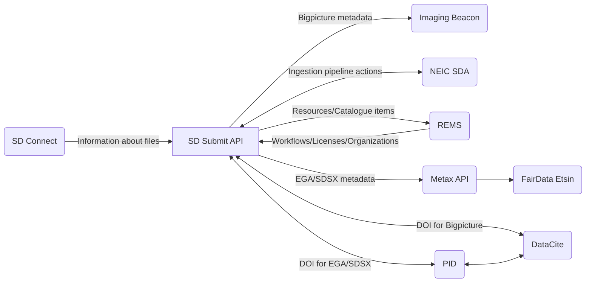

# SD Submit API


[](https://coveralls.io/github/CSCfi/metadata-submitter?branch=main)
[](https://github.com/pre-commit/pre-commit)
[](https://github.com/PyCQA/pylint)

SD Submit API supports sensitive data submissions.

The SD Submit UI is implemented
here: [metadata-submitter-frontend](https://github.com/CSCfi/metadata-submitter-frontend).

SD Submit API uses the following external services via their respective API:

- SD Connect ([source code](https://github.com/CSCfi/swift-browser-ui))
- Imaging Beacon ([source code](https://github.com/CSCfi/imaging-beacon))
- NeIC Sensitive Data Archive ([docs](https://neic-sda.readthedocs.io/en/latest/))
- REMS ([source code](https://github.com/CSCfi/rems))
- Metax ([docs](https://metax.fairdata.fi/docs/))
- DataCite ([docs](https://support.datacite.org/))
- CSC PID



## 💻 Development

<details><summary>Click to expand</summary>

### Prerequisites

- `Docker`
- [`Vault CLI`](https://developer.hashicorp.com/vault/docs/get-vault)
- [`Git LFS`](https://git-lfs.com/)

Git LFS is required to checkout the `metadata_backend/conf/taxonomy_files/names.json` file.
Without Git LFS, this file can also be generated from NCBI taxonomy using the following command:

```bash
scripts/taxonomy/generate_name_taxonomy.sh
```

### Initialise the project for development and testing

Clone the repository and go to the project directory:

```bash
git clone
cd metadata-submitter
```

Install `uv`, `tox` and `pre-commit` tools for development:

```bash
curl -LsSf https://astral.sh/uv/install.sh | sh
uv tool install tox --with tox-uv
uv tool install pre-commit --with pre-commit-uv
pre-commit install
```

The project is managed by [`uv`](https://docs.astral.sh/uv/) (Python package and project manager),
which creates a virtual Python environment in `.venv` directory using the version defined in the [`.python-version`](.python-version).
`uv` installs the dependencies in `uv.lock` file that are specified in the `pyproject.toml` file.

Whenever initiating a local development environment, it is a good idea to run the following commands:
```bash
uv self update  # update uv
uv sync --dev  # sync all python dependencies
source .venv/bin/activate  # activate the uv venv
```

### Configure environment variables

Copy the contents of `.env.example` file to `.env` file and edit it as needed:

```bash
cp .env.example .env
```

Additionally, secrets for live services can be inserted into the `.env` file automatically with:

```bash
export VAULT_ADDR=  # Define URL address for a Vault instance
make get_env  # This will prompt a login in the web browser
```

### Run the web service and database locally

Launch both server and database with Docker by running: `docker compose up --build` (add `-d` flag to the command to run
containers in the background).

Server can then be found from `http://localhost:5430`.

> **If you also need to initiate the graphical UI for developing the API**, check
> out [metadata-submitter-frontend](https://github.com/CSCfi/metadata-submitter-frontend/) repository and follow its
> development instructions. You will then also need to set the `REDIRECT_URL` environment variable to the UI address (e.g.
> add `REDIRECT_URL=http://localhost:3000` into the `.env` file) and relaunch the development environment as specified
> above.

Alternatively, there is a more convenient method for developing the SD Submit API via a
_**Python virtual environment using a Procfile**_, which is described here below.

### Developing with Python virtual environment

Use `uv` to create and activate the virtual environment for development and testing as [instructed above](#initialise-the-project-for-development-and-testing).
Then follow these instructions:

```bash
# Optional: update references for metax integration
scripts/metax_mappings/fetch_refs.sh

# Optional: update taxonomy names for taxonomy search endpoint
# However, this is a NECESSARY step if you have not installed Git LFS
scripts/taxonomy/generate_name_taxonomy.sh
```

Then copy `.env` file and set up the environment variables.
The example file has hostnames for development with Docker network (via `docker compose`).
You will have to change the hostnames to `localhost`.

```bash
cp .env.example .env  # Make any changes you need to the file
```

Secrets, which are used for testing against other services are fetched from Vault and added to the `.env` file with the
following:

```bash
export VAULT_ADDR=  # Add correct URL here
make get_env  # This will prompt a login in the web browser
```

Finally, start the servers with code reloading enabled, so any code changes restarts the servers automatically:

```bash
honcho start
```

The development server should now be accessible at `localhost:5430`.
If it doesn't work right away, check your settings in `.env` and restart the servers manually if you make changes to
`.env` file.

### OpenAPI Specification docs with Swagger

Swagger UI for viewing the API specs is already available in the production docker image. During development, you can
enable it by executing: `bash scripts/swagger/generate.sh`.

Restart the server, and the swagger docs will be available at http://localhost:5430/swagger.

**Swagger docs requirements:**

- `bash`
- `Python 3.14+`
- `PyYaml` (installed via the development dependencies)
- `realpath` (default Linux terminal command)

### Keeping Python requirements up to date

The project Python package dependencies are automatically being kept up to date
with [renovatebot](https://github.com/renovatebot/renovate).

Dependencies are added and removed to the project using the `uv` commands or by directly editing the `pyproject.toml`
file. In the latter case run `uv sync` or `uv sync --dev` to update the `uv.lock` file.

</details>

## 🛠️ Contributing

<details><summary>Click to expand</summary>

Development team members should check
internal [contributing guidelines for Gitlab](https://gitlab.ci.csc.fi/groups/sds-dev/-/wikis/Guides/Contributing).

If you are not part of CSC and our development team, your help is nevertheless very welcome. Please
see [contributing guidelines for Github](CONTRIBUTING.md).

</details>

## 🧪 Testing

<details><summary>Click to expand</summary>

For local testing, see [above instructions](#initialise-the-project-for-development-and-testing)
for installing `uv` to create a virtual environment.

Install all testing dependencies in the virtual environment by running the following commands:
```bash
uv pip install ".[verify,test,docs]"
source .venv/bin/activate  # activate uv virtual env
```

A pre-commit hook will execute all linting and unit tests before each commit.
All tests are also run in the Gitlab CI/CD pipeline for every merge request.

### Linting and Unit tests

Majority of the automated tests (such as unit tests, code style checks etc.)
can be run with [`tox`](https://tox.wiki/en/4.24.2/) automation with the following command:

```bash
tox -p auto
```

### Integration tests

Integration tests are run separately with [`pytest`](https://docs.pytest.org/en/stable/)
after the containerized testing environment has been set up.

Integration tests can be run using mock services:

```bash
docker compose --env-file tests/integration/.env.example --profile dev up --build -d
pytest tests/integration
```

Or using external services configured with secrets:

```bash
make get_env
docker compose --env-file tests/integration/.env --profile dev up --build -d
pytest tests/integration
```

</details>

## 🚀 Deployment

<details><summary>Click to expand</summary>

Production version can be built and run with following docker commands:

```bash
docker build --no-cache -f dockerfiles/Dockerfile -t cscfi/metadata-submitter .
docker run -p 5430:5430 cscfi/metadata-submitter
```

The [frontend](https://github.com/CSCfi/metadata-submitter-frontend) is built and added as static files to the backend
deployment with this method.

> Helm charts for a kubernetes cluster deployment will also be available soon™️.

</details>

## 📜 License

<details><summary>Click to expand</summary>

Metadata submission interface is released under `MIT`, see [LICENSE](LICENSE).

</details>
