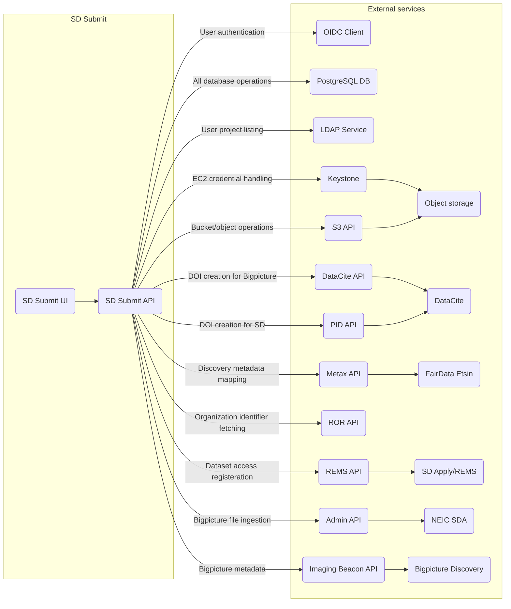

# SD Submit API

[](https://github.com/astral-sh/uv)
[](https://github.com/astral-sh/ruff)
[](https://github.com/pre-commit/pre-commit)

SD Submit API supports sensitive data submissions.

The SD Submit UI is implemented
here: [metadata-submitter-frontend](https://github.com/CSCfi/metadata-submitter-frontend).

SD Submit API integrates with the following external services:

- OIDC Client of an OpenID Provider
- PostgreSQL database
- CSC LDAP service
- Keystone (OpenStack Identity API) ([docs](https://docs.openstack.org/api-ref/identity/v3/))
- S3 ([docs](https://docs.aws.amazon.com/AmazonS3/latest/API/Type_API_Reference.html))
- DataCite ([docs](https://support.datacite.org/docs/api))
- CSC PID
- Metax ([docs](https://metax.fairdata.fi/docs/))
- ROR ([docs](https://ror.readme.io/docs/rest-api))
- REMS ([source code](https://github.com/CSCfi/rems))
- NeIC Sensitive Data Archive ([docs](https://neic-sda.readthedocs.io/en/latest/))
- Imaging Beacon ([source code](https://github.com/CSCfi/imaging-beacon))



## 💻 Development

<details><summary>Click to expand</summary>

### Prerequisites

- `Docker`
- [`Vault CLI`](https://developer.hashicorp.com/vault/docs/get-vault)

### Initialise the project for development and testing

Clone the repository and go to the project directory:

```bash
git clone
cd metadata-submitter
```

Install `uv`, `tox` and `pre-commit` tools for development:

```bash
curl -LsSf https://astral.sh/uv/install.sh | sh
uv tool install tox --with tox-uv
uv tool install pre-commit --with pre-commit-uv
pre-commit install
```

The project is managed by [`uv`](https://docs.astral.sh/uv/) (Python package and project manager),
which creates a virtual Python environment in `.venv` directory using the version defined in the [
`.python-version`](.python-version).
`uv` installs the dependencies in `uv.lock` file that are specified in the `pyproject.toml` file.

Whenever initiating a local development environment, it is a good idea to run the following commands:

```bash
uv self update  # update uv
uv sync --dev  # sync all python dependencies
source .venv/bin/activate  # activate the uv venv
```

### Configure environment variables

Secret values for live services can be written into the `.env` file automatically with:

```bash
export VAULT_ADDR=  # Define URL address for a Vault instance
make get_env  # This will prompt a login in the web browser
```

### Run the web service and database locally

Launch both server and database with Docker by running: `docker compose --profile dev up --build` (add `-d` flag to the command to run
containers in the background).

Server can then be found from `http://localhost:5430`.

> **If you also need to initiate the graphical UI for developing the API**, check
> out [metadata-submitter-frontend](https://github.com/CSCfi/metadata-submitter-frontend/) repository and follow its
> development instructions. You will then also need to set the `REDIRECT_URL` environment variable to the UI address (
> e.g.
> add `REDIRECT_URL=http://localhost:3000` into the `.env` file) and relaunch the development environment as specified
> above.

Alternatively, there is a more convenient method for developing the SD Submit API via a
_**Python virtual environment using a Procfile**_, which is described here below.

### Developing with Python virtual environment

Use `uv` to create and activate the virtual environment for development and testing
as [instructed above](#initialise-the-project-for-development-and-testing).

Then [configure environment variables](#configure-environment-variables) and edit the
generated `.env` file as needed. The environment variables include hostnames for
development within a Docker network (via the use of `docker compose`).
These mock hostnames need to be renamed to `localhost`.

Finally, start the servers with code reloading enabled, so any code changes restarts
the servers automatically:

```bash
honcho start
```

The development server should now be accessible at `localhost:5430`.
If it doesn't work right away, check your settings in `.env` and restart the servers
manually if you make changes to `.env` file.

### Keeping Python requirements up to date

The project Python package dependencies are automatically being kept up to date
with [renovatebot](https://github.com/renovatebot/renovate).

Dependencies are added and removed to the project using the `uv` commands or by directly editing the `pyproject.toml`
file. In the latter case run `uv sync` or `uv sync --dev` to update the `uv.lock` file.

</details>

## 🛠️ Contributing

<details><summary>Click to expand</summary>

Development team members should check
internal [contributing guidelines for Gitlab](https://gitlab.ci.csc.fi/groups/sds-dev/-/wikis/Guides/Contributing).

If you are not part of CSC and our development team, your help is nevertheless very welcome. Please
see [contributing guidelines for Github](CONTRIBUTING.md).

</details>

## 🧪 Testing

<details><summary>Click to expand</summary>

For local testing, see [above instructions](#initialise-the-project-for-development-and-testing)
for installing `uv` to create a virtual environment.

Install all testing dependencies in the virtual environment by running the following commands:

```bash
uv pip install ".[verify,test,docs]"
source .venv/bin/activate  # activate uv virtual env
```

A pre-commit hook will execute all linting and unit tests before each commit.
All tests are also run in the Gitlab CI/CD pipeline for every merge request.

### Linting and Unit tests

Majority of the automated tests (such as unit tests, code style checks etc.)
can be run with [`tox`](https://tox.wiki/en/4.24.2/) automation with the following command:

```bash
tox -p auto
```

### Integration tests

Integration tests are run with [`pytest`](https://docs.pytest.org/en/stable/)
after the containerized testing environment has been set up.

Integration tests can be run with the following commands:
```bash
# Get secrets and write .env file
make get_env

# Build and run all backend containers
docker compose --env-file tests/integration/.env --profile dev up --build -d

# Run tests
pytest tests/integration
```

### Performance tests

Performance tests are run with [`locust`](https://locust.io//).
They use the same test containers as the integrations tests,
and are executed using the following commands:

```bash
cd tests/performace
locust -f locustfile_csc.py
locust -f locustfile_nbis.py -u 2
```

The CSC and NBIS deployments have their own performance test files. The
number of users (-u) has to be set to at least two to run all NBIS tests.

</details>

## Resources

<details><summary>Click to expand</summary>

Two resource files used by Metax are stored in metadata_backend/resource/metax directory:

- `geo_locations.json`
- `languages.json`

These files can be refreshed by running:

```bash
uv run metadata_backend/scripts/fetch_metax.py
```

</details>


## 🚀 Deployment

<details><summary>Click to expand</summary>

### Dockerfile

The Docker image can be built using the Dockerfile located in dockerfiles directory:

```bash
docker build --no-cache -f dockerfiles/Dockerfile -t cscfi/metadata-submitter .
```

Once built, run the container with:

```bash
docker run -p 5430:5430 cscfi/metadata-submitter
```

### Helm charts

> Helm charts for a kubernetes cluster deployment will also be available soon™️.

</details>

## 📜 License

<details><summary>Click to expand</summary>

Metadata submission interface is released under `MIT`, see [LICENSE](LICENSE).

</details>
